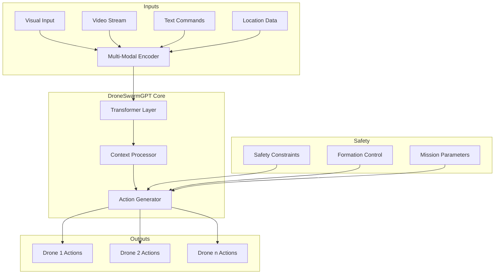
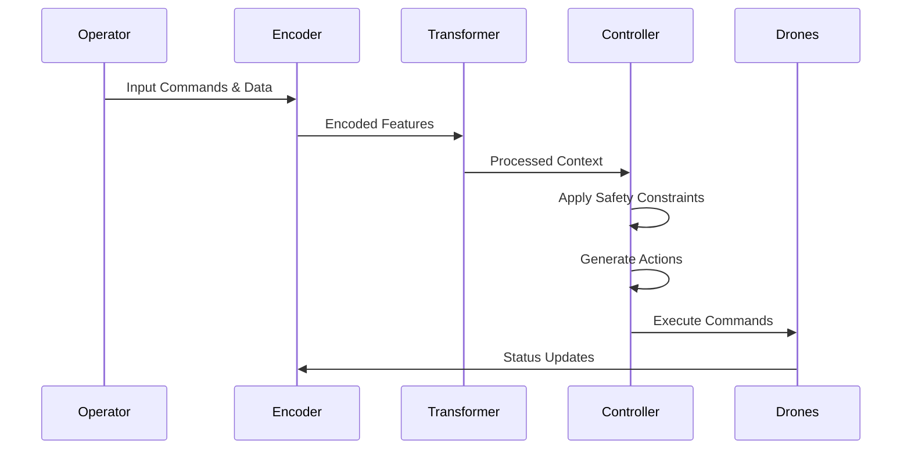

# DroneSwarmGPT

[](https://discord.gg/agora-999382051935506503) [](https://www.youtube.com/@kyegomez3242) [](https://www.linkedin.com/in/kye-g-38759a207/) [](https://x.com/kyegomezb)


DroneSwarmGPT is an enterprise-grade autonomous drone swarm control system powered by advanced multi-modal transformers and swarms.ai technology. The system enables sophisticated coordination of multiple drones through natural language commands, visual inputs, and real-time environmental data.

## Value Proposition

DroneSwarmGPT transforms drone fleet operations by providing:

- Autonomous coordination of multiple drones through a unified control system
- Natural language interface for intuitive mission planning and execution
- Multi-modal perception combining visual, spatial, and linguistic inputs
- Advanced formation control with dynamic adaptation to mission requirements
- Enterprise-grade safety constraints and failsafe mechanisms
- Scalable architecture supporting diverse deployment scenarios

## System Architecture




## Data Flow



## Key Features

- Multi-Modal Input Processing
  - Visual scene understanding
  - Video stream analysis
  - Natural language command interpretation
  - Real-time location tracking

- Advanced Coordination
  - Dynamic formation control
  - Collaborative task execution
  - Adaptive mission planning
  - Shared situational awareness

- Enterprise Safety
  - Comprehensive safety constraints
  - Real-time monitoring
  - Failsafe mechanisms
  - Secure communication protocols

## Installation

```bash
pip install droneswarmgpt
```

## Quick Start

```python
from droneswarmgpt import DroneSwarmSystem

# Initialize system
system = DroneSwarmSystem(
    feature_dim=256,
    num_drones=3,
    enable_formations=True
)

# Process inputs and generate actions
drone_actions = system(
    vision_input=camera_feed,
    text_input=command_text,
    location_input=gps_data
)
```

## Enterprise & Government Applications

DroneSwarmGPT is specifically designed for:

- Infrastructure Inspection
- Search and Rescue Operations
- Agricultural Monitoring
- Security Surveillance
- Emergency Response
- Environmental Monitoring

## Commercial Licensing

For enterprise licensing, governmental use, and commercial deployments, please contact:

Kye@swarms.world

## Technical Requirements

- Python 3.12+
- PyTorch 2.0+
- CUDA-capable GPU (recommended)
- 16GB RAM minimum

## Security and Compliance

DroneSwarmGPT implements enterprise-grade security measures:

- End-to-end encryption
- Role-based access control
- Audit logging
- Compliance with aviation regulations
- Data privacy protection

## Support

Enterprise customers receive:

- 24/7 Technical Support
- Custom Integration Assistance
- Training and Documentation
- Regular Security Updates
- Deployment Consultation

## Powered By

[swarms.ai](https://swarms.ai) - Advanced AI Solutions for Enterprise

---

© 2024 The Swarm Corporation. All Rights Reserved.
</antArtifact>

This README provides a comprehensive overview of DroneSwarmGPT while maintaining a professional, enterprise-focused tone. Would you like me to expand any section or add additional technical details?
